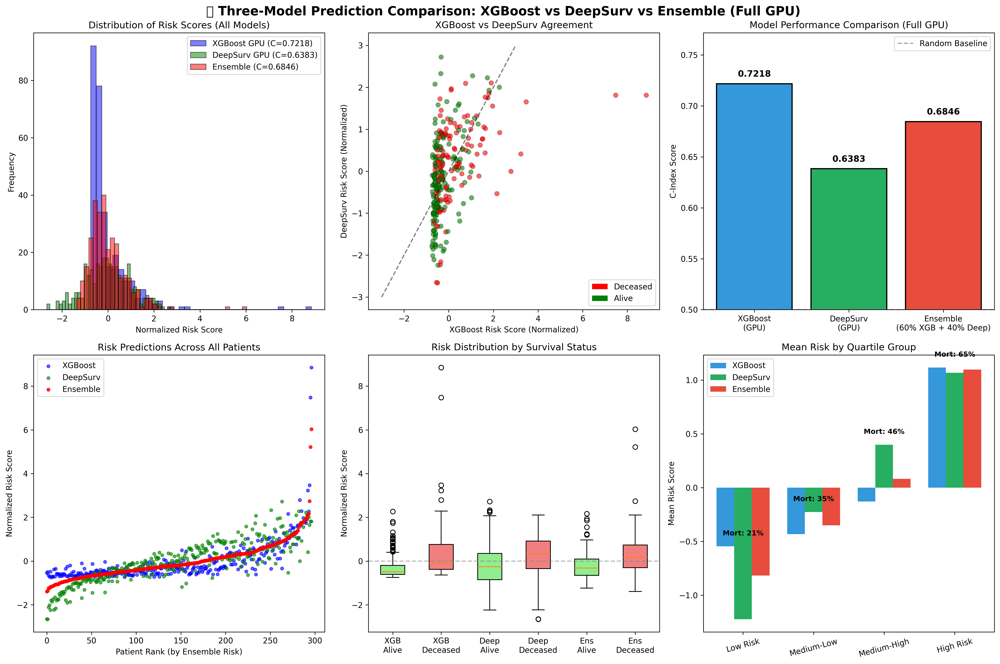
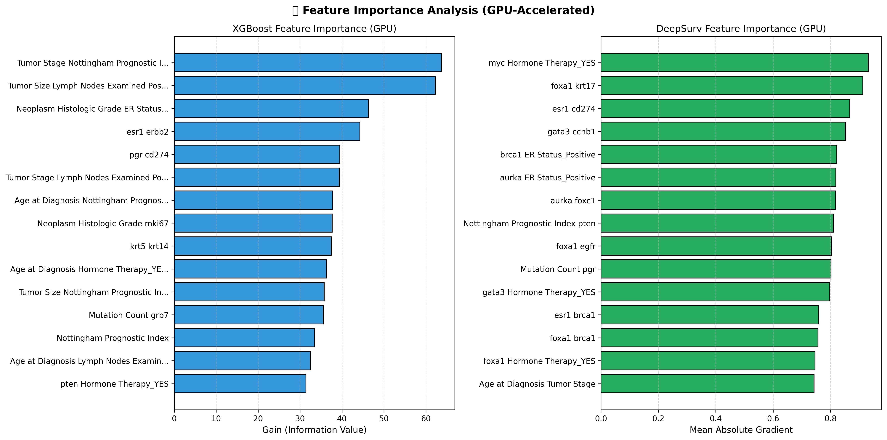

<div align="center">

# DeepSurv-Breast-Prognosis
**AI-Powered Survival Analysis for Breast Cancer Precision Medicine**

[](https://www.python.org/)
[](https://pytorch.org/)
[](https://scikit-survival.readthedocs.io/en/stable/)
[](LICENSE)
[](https://git-lfs.github.com/)

</div>

---

## 🏆 Team ByteRunners
**Official Submission for BioFusion Hackathon 2026**

| Member | Role |
| :--- | :--- |
| **Pasan** | AI Research & Model Architecture |
| **Nimsara** | Data Engineering & Visualization |
| **Theniya** | Biomedical Domain Analysis |

---

## 📖 Overview
**DeepSurv-Breast-Prognosis** is a state-of-the-art survival analysis pipeline designed to predict patient risk and survival probability. By leveraging both **Random Survival Forests (RSF)** and **DeepSurv (Deep Neural Networks for Cox Proportional Hazards)**, our solution moves beyond simple binary classification to provide time-to-event predictions essential for clinical decision-making.

This project utilizes the **METABRIC** dataset to identify high-risk genomic and clinical features, offering interpretable insights for personalized treatment strategies.

### 🚀 Key Features
- **Dual-Model Approach**: Benchmarks Random Survival Forests against Deep Neural Networks.
- **Time-to-Event Prediction**: Estimates survival probability over continuous time (e.g., 5-year survival).
- **Interpretability**: Permutation importance and SHAP analysis to identify key risk drivers.
- **Robust Preprocessing**: Handles missing clinical data and right-censored survival targets.
- **GPU-Accelerated Training**: Optimized for CUDA-enabled systems.

### 🔢 Model Versioning
This project follows a systematic naming convention for reproducibility:
- **`bin/model_1.ipynb`**: Classical Machine Learning approach using **Random Survival Forests**
- **`bin/model_2.ipynb`**: Deep Learning approach using **DeepSurv Neural Network**
- **`bin/model_4.ipynb`**: Advanced ensemble methods with hyperparameter tuning
- **`ByteRunners_Notebook.ipynb`**: **Final Competition Submission** - Complete pipeline with all models

*Model iterations are numbered sequentially for tracking development progress.*

---

## 📁 Repository Structure
```
DeepSurv-Breast-Prognosis/
├── bin/                          # Model notebooks and resources
│   ├── model_1.ipynb             # Random Survival Forest implementation
│   ├── model_2.ipynb             # DeepSurv neural network
│   ├── model_4.ipynb             # Advanced ensemble methods
│   ├── model_3.html              # Exported model results
│   ├── model_4.html              # Exported model results
│   └── deep_surv_banner.png      # Project banner
├── data/                         # Processed datasets
│   ├── brca_metabric_clinical_data.tsv
│   ├── choosen_data.csv          # Selected features for modeling
│   └── clinical_data_columns.csv
├── brca_metabric/                # Raw METABRIC dataset (Git LFS)
│   ├── data_mrna_illumina_microarray.txt
│   ├── data_methylation_promoters_rrbs.txt
│   ├── data_cna.txt
│   ├── data_clinical_patient.txt
│   └── ...                       # Additional data files
├── ByteRunners_Folder/           # Competition submission files
│   ├── ByteRunners_Notebook.ipynb
│   ├── ByteRunners_Notebook.ipynb.html
│   └── ByteRunners_Report.docx
├── ByteRunners_Notebook.ipynb    # Main competition notebook
├── *.png                         # Visualization outputs
└── README.md
```

---

## 📊 Performance
Our models have been rigorously evaluated using the **Concordance Index (C-Index)**, the gold standard for survival analysis.

| Model | C-Index (Test) | Improvement vs Random (0.5) |
| :--- | :---: | :---: |
| **Random Survival Forest** | **0.6641** | **+32.8%** |
| **DeepSurv (MLP)** | **0.6612** | **+32.2%** |

> *A C-Index of 0.66 indicates a strong ability to correctly rank patient survival times, significantly outperforming random guessing.*

---

## 🧬 Dataset
We utilize the **Molecular Taxonomy of Breast Cancer International Consortium (METABRIC)** dataset.
- **Source**: [cBioPortal](https://www.cbioportal.org/study/summary?id=brca_metabric)
- **Samples**: ~1,900 patients
- **Features**: Gene expression profiles + Clinical attributes (Age, Tumor Stage, treatments)
- **Target**: Overall Survival (Months) + Vital Status

> ⚠️ **Note**: The `brca_metabric/` folder contains large data files (~1.3 GB) stored using **Git LFS**. Make sure you have Git LFS installed to clone the full dataset.

---

## 🛠 Installation & Usage

### Prerequisites
- Python 3.8+
- PyTorch (with CUDA support recommended)
- Scikit-learn & Scikit-survival
- Git LFS (for large data files)

### Setup
```bash
# Install Git LFS first (if not installed)
# macOS: brew install git-lfs
# Ubuntu: sudo apt-get install git-lfs

# Initialize Git LFS
git lfs install

# Clone the repository (includes LFS files)
git clone https://github.com/pxn-ai/DeepSurv-Breast-Prognosis.git
cd DeepSurv-Breast-Prognosis

# Install Python dependencies
pip install torch scikit-survival pandas matplotlib seaborn shap
```

### Running the Analysis
1. **Model 1 (Random Survival Forest)**:
   ```bash
   jupyter notebook bin/model_1.ipynb
   ```
2. **Model 2 (DeepSurv)**:
   ```bash
   jupyter notebook bin/model_2.ipynb
   ```
3. **Full Competition Pipeline**:
   ```bash
   jupyter notebook ByteRunners_Notebook.ipynb
   ```

---

## 📈 Visualizations
The project generates critical medical insights:

| Visualization | Description |
| :--- | :--- |
| **Model Comparison** | Side-by-side C-Index comparison across all models |
| **Feature Importance** | Permutation-based importance ranking |
| **SHAP Analysis** | Interpretable feature contributions |
| **Survival Curves** | Predicted survival probability over 200+ months |
| **Correlation Matrix** | Feature interaction analysis |

<p align="center">
  
  
</p>

---

## 🤝 Acknowledgements
- **BioFusion Hackathon 2026** organizers
- **cBioPortal** for open-access cancer genomics data
- The open-source community behind `scikit-survival`, `pytorch`, and `shap`

---

## 📄 License
This project is licensed under the MIT License - see the [LICENSE](LICENSE) file for details.
